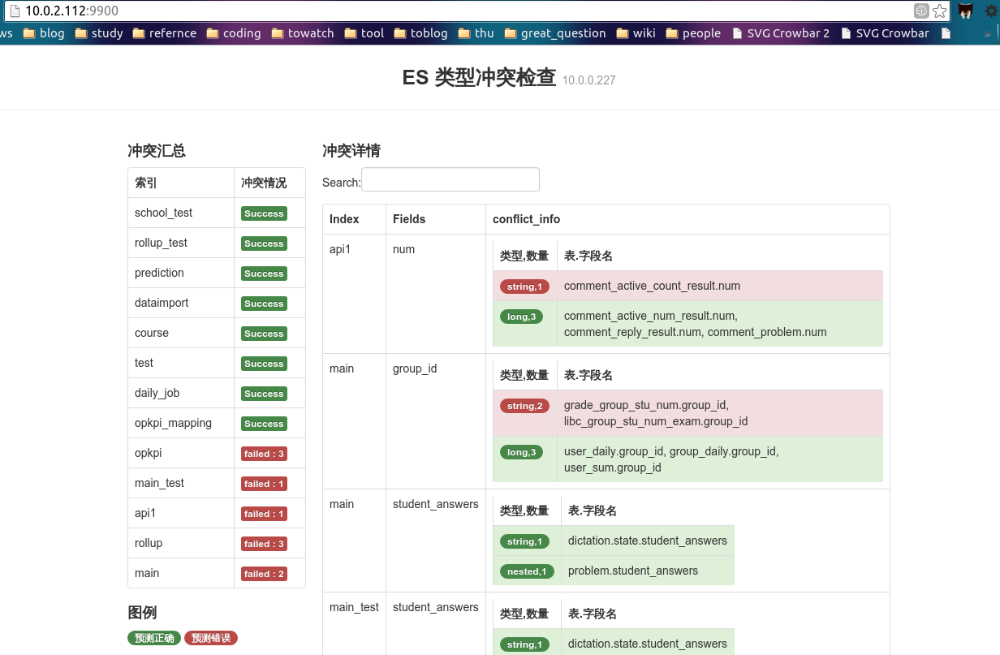
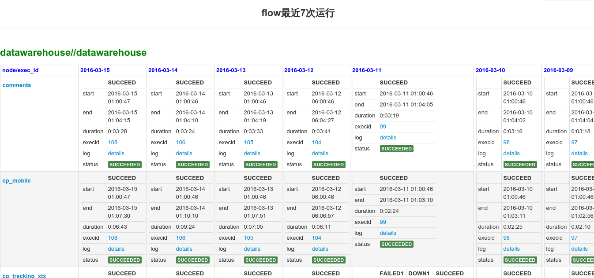
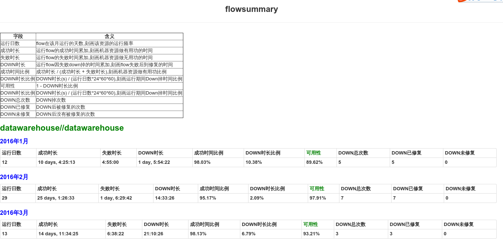
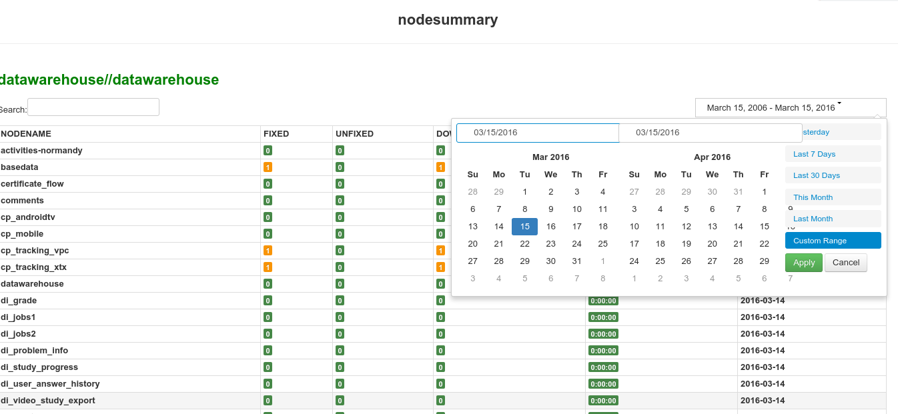

# dp_tools
这是我在某教育公司数据平台组研制的小工具

## estype_conflict_check
- elastic search 数据库作为数据产出的目的地,在做后续数据统计分析是,如果代表相同含义的指标数据类型不一致(例如字符串和整数),聚合将会出错.本项目在于监控es数据库中每个表名字相同但数据类型不一致的冲突.
- 使用: 访问 http:127.0.0.1:9900/conflict
## azkaban flow运行数据统计
- [azkaban](http://azkaban.github.io/)是一个任务流管理工具,公司利用其管理每天需要进行的离线数据处理任务
- 数据处理任务程序的健壮性是组内非常关注的一个指标,本项目利用azkaban提供的[ajax api](http://azkaban.github.io/azkaban/docs/latest/#ajax-api)按月份统计离线数据分析处理任务的可用性.
- 使用: 访问 http:127.0.0.1:9900/index

# How to run
`git clone https://github.com/tracyliang18/dp_tools.git`

`cd dp_tools
python2 server.py (默认端口为9900)`

# Tools details

## estype_conflict_check

elastic search数据库同名字段不同类型在聚合时会出现问题,必须确保同名字段同类型.检查的依据是elastic search server 中的[http://es_ip:es_port/_mappings](http://es_ip:es_port/_mappings)

## 示例

## azkaban flows 天级别运行统计

### 外部依赖：
- azkaban(3.0) backend db(mysql) 数据库访问权限
- 正在运行的azkaban server（提供ajax api 调用）
- mongodb (储存)
- crontab job.py（每天需要运行一次job.py并将结果保存到mongodb)

### 目前统计示例：

#### flow最近7天运行

以天为单位，描述了flow每天execution的汇总情况。列为时间天，行为flow中job节点的详细情况。flow中的每个节点可能包含succeed，failed，down，recent的信息。

一个flow单天可以执行多次executions，所以涉及到executions的合并。executions的合并逻辑在 [models/utils/merge_node](models/utils.py)

- 一个node即为一次executions里的一个job
- node status :READY SKIPPED RUNNING SUCCEEDED KILLED CANCELLED FAILED
- merge node logic:
    把同一天（同一天开始的execution进行合并）在不同executions执行的node进行合并。

    1. 如果nodes有成功(SUCCEEDED)的节点,取最后一次的成功节点作为成功的代表节点

    2. 如果nodes有失败(FAILED)的有节点，需要显示故障时间，故障时间计算规则如下：
        - 如果该失败节点后有成功的节点，则故障时间（DOWN）为该失败节点的结束时间到该节点后第一个成功节点的开始时间
        - 否则故障时间（DOWN）直到当前

    3. 如果既没有成功,也没有失败,则显示待定（RECENT）

example: http://ip:port/jobinfo/pf?project=datawarehouse&flow=datawarehouse

#### flow summary

按月份总结flow的执行情况。包括如下信息

<table border="1">
 <tr>
   <th>字段</th>
   <th>含义</th>
 </tr>
 <tr>
   <td>运行日数</td>
   <td>flow在该月运行的天数,刻画该资源的运行频率</td>
 </tr>
 <tr>
   <td>成功时长</td>
   <td>运行flow的成功时间累加,刻画机器资源做有用功的时间</td>
 </tr>

 <tr>
   <td>失败时长</td>
   <td>运行flow的失败时间累加,刻画机器资源做无用功的时间</td>
 </tr>

 <tr>
   <td>DOWN时长</td>
   <td>运行flow因失败down掉的时间累加,刻画flow失败后到修复的时间</td>
 </tr>

 <tr>
   <td>成功时间比例</td>
   <td>成功时长 / (成功时长 + 失败时长),刻画机器资源做有用功比例</td>
 </tr>

 <tr>
   <td>DOWN时长比例</td>
   <td>DOWN时长(s) / (运行日数*24*60*60),刻画运行期间Down掉时间比例</td>
 </tr>

 <tr>
   <td>可用性</td>
   <td>1 - DOWN时长比例</td>
 </tr>

 <tr>
   <td>DOWN时长比例</td>
   <td>DOWN时长(s) / (运行日数*24*60*60),刻画运行期间Down掉时间比例</td>
 </tr>
 <tr>
   <td>DOWN总次数</td>
   <td>DOWN掉次数</td>
 </tr>
 <tr>
   <td>DOWN已修复</td>
   <td>DOWN后被修复的次数</td>
 </tr>
 <tr>
   <td>DOWN未修复</td>
   <td>DOWN后没有被修复的次数</td>
 </tr>
</table>

example: http://10.0.2.112:9900/flowsummary/pf?project=datawarehouse&flow=datawarehouse

### node summary

按指定时间粒度统计flow中各节点的运行情况.

